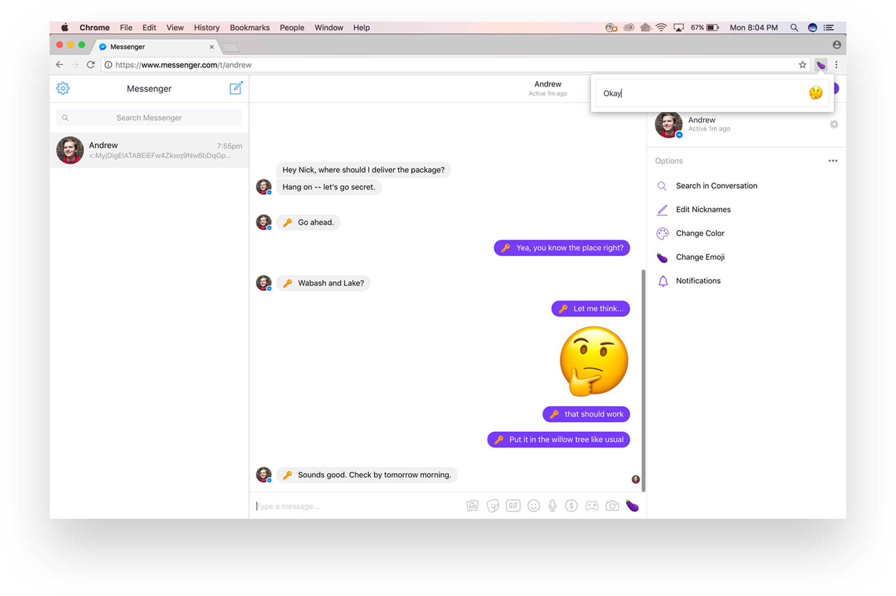

# Phat Emoji

### To run your extension, follow these steps:
1. Visit `chrome://extensions` in your browser
1. Ensure that the **Developer mode** checkbox in the top right-hand corner is checked.
1. Click **Load unpacked extension** to pop up a file-selection dialog.
1. Navigate to the directory in which your extension files live, and select it.

